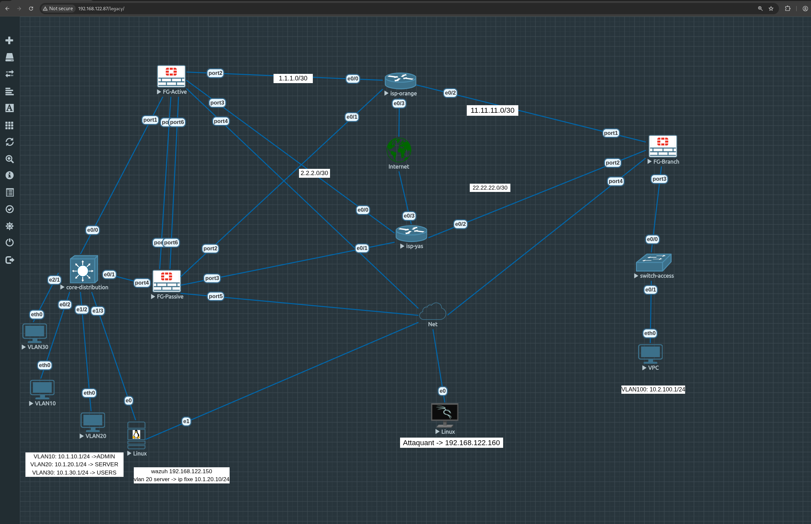

# 🛡️ IRON-GRID — Hardened Enterprise Network Lab

[](https://opensource.org/licenses/MIT)
[](https://www.eve-ng.net/)
[](https://www.fortinet.com/)
[](https://wazuh.com/)
[](https://en.wikipedia.org/wiki/Zero_trust_security_model)
[]()

---

## 📖 Overview

**IRON-GRID** is a self-built, professional-grade enterprise network lab simulated on **EVE-NG**. It replicates a corporate infrastructure following **Defense-in-Depth** and **Zero-Trust Architecture (ZTA)** principles.

The lab is designed as a full **Purple Team** environment — Blue Team builds and hardens, Red Team attacks and documents, both sides learn from each other.

> **Scope:** Virtualized lab environment only. All offensive operations are performed in an isolated, controlled network with no connection to production or external systems.

---

## 🧠 Architecture

### Network Topology



The infrastructure is segmented into isolated trust zones managed by a **FortiGate VM64-KVM HA Cluster**:

| Zone | VLAN | Subnet | Role |
|------|------|--------|------|
| **LAN_USERS** | VLAN 10 | `10.1.10.0/24` | Employee workstations |
| **SERVERS** | VLAN 20 | `10.1.20.0/24` | DNS, LDAP, Samba, Monitoring |
| **GUESTS** | VLAN 30 | `10.1.30.0/24` | Isolated guest access |
| **MGMT** | — | `192.168.122.0/24` | Out-of-band EVE-NG management |

### WAN & Inter-Site Links

| Link | Network |
|------|---------|
| FG-Active ↔ ISP (WAN1) | `1.1.1.0/30` |
| FG-Branch ↔ ISP (WAN2) | `11.11.11.0/30` |
| HA Heartbeat | `2.2.2.0/30` |
| Branch secondary uplink | `22.22.22.0/30` |

---

## 🛠️ Tech Stack

### 🔒 Security & Networking

| Component | Technology | Role |
|-----------|-----------|------|
| NGFW (HA) | FortiGate VM64-KVM | Perimeter firewall, SD-WAN, VPN, IPS |
| Identity | OpenLDAP + LDAPS | Centralized authentication |
| IDS/Monitoring | Wazuh (SIEM/XDR) | Threat detection, FIM, active response |
| Host Firewall | UFW + Fail2Ban | Layer 2 defense on Ubuntu server |
| Attacker | Kali Linux | Red Team operations |

### 🖥️ Infrastructure Services

| Service | Technology | Details |
|---------|-----------|---------|
| DNS | BIND9 | Internal domain `it.local`, DNSSEC-ready |
| Directory | OpenLDAP | `dc=it,dc=local` — users & groups |
| File Sharing | Samba | SMB/CIFS share mapped to LDAP identities |
| Web | Nginx | Portfolio & project docs — `portfolio.it.local` |
| Automation | Python + Bash | Service health checks, config backups |

---

## 🔁 FortiGate HA Cluster

Active/Passive cluster with sub-second failover:

- **FG-Active** (Master): `192.168.122.99` — handles all live traffic
- **FG-Passive** (Slave): `192.168.122.110` — standby, synchronized state
- **Heartbeat**: Dedicated link `2.2.2.0/30`
- **Sync scope**: Sessions, routing table, firewall policies, IPS signatures

> Screenshot: [`screenshots/ha-status-failover.png`](screenshots/ha-status-failover.png)

---

## 🛡️ Blue Team — Hardening & Defense

<details>
<summary><b>Click to expand</b></summary>

### OS Hardening (Ubuntu Server)
- Automated security patching via `unattended-upgrades`
- Unnecessary daemons disabled (`avahi-daemon`, `cups`, etc.)
- CIS Benchmark baseline applied

### SSH Hardening
- Non-standard port (`2222` instead of `22`)
- Root login disabled (`PermitRootLogin no`)
- Password authentication disabled — Ed25519 keys only
- Fail2Ban: 3 attempts → 1h ban, injected into UFW dynamically

### Firewall Policy (UFW)

| Service | Port | Protocol | Status |
|---------|------|----------|--------|
| SSH | 2222 | TCP | Open — admin only |
| DNS | 53 | TCP/UDP | Open — internal LAN |
| LDAP | 389 | TCP | Open — internal LAN |
| Samba | 445 | TCP | Open — internal LAN |
| HTTP/S | 80, 443 | TCP | Open — portfolio |

### FortiGate Zero-Trust Policies
- **Implicit deny-all** — no inter-VLAN traffic unless explicitly permitted
- **Stateful inspection** — AV, IPS, Web Filter active on all flows
- **LDAPS enforced** — plain LDAP blocked at firewall level
- **SMBv1 disabled** — Samba enforces packet signing

### Wazuh SIEM (Active Response)
- File Integrity Monitoring on `/etc/bind/`, `/etc/ldap/`, `/etc/ssh/sshd_config`
- FortiGate log ingestion via Syslog → automated alert correlation
- Active response: Wazuh triggers UFW block on detected brute-force sources

</details>

---

## ⚔️ Red Team — Attack Scenarios

All attacks originate from the Kali Linux machine (`192.168.122.160`) on the isolated lab network.

| # | Phase | Technique | Tool | Status |
|---|-------|-----------|------|--------|
| 01 | Reconnaissance | Stealth port scan + service enumeration | `nmap -sV -sS` | ✅ Done |
| 02 | Brute-Force | SSH dictionary attack → Fail2Ban trigger | `hydra` | ✅ Done |
| 03 | LDAP Enumeration | Anonymous bind test, user/group dump | `ldapsearch` | ✅ Done |
| 04 | SMB Enumeration | Share listing, null session test | `enum4linux`, `smbclient` | ✅ Done |
| 05 | FIM Evasion Test | Unauthorized sshd_config modification | Manual | ✅ Done |
| 06 | Lateral Movement | VLAN 30 → VLAN 10 pivot attempt | `nmap`, routing | 🔄 In Progress |
| 07 | DNS Tunneling | Exfiltration via DNS to test detection | `iodine` | 📋 Planned |
| 08 | Web Exploitation | SQLi & JWT bypass on DMZ app | `sqlmap`, `Burp` | 📋 Planned |

> Full methodology → [`docs/pentest-report.md`](docs/pentest-report.md)

---

## 📂 Project Structure

```
IRON-GRID/
├── README.md
├── topologie.png                        ← EVE-NG topology diagram
│
├── docs/
│   ├── architecture.md                  ← ZTA design & traffic flows
│   ├── network-design.md                ← IP plan, VLANs, interfaces
│   ├── security-hardening.md            ← Step-by-step hardening guide
│   └── pentest-report.md                ← Purple Team assessment findings
│
├── infrastructure/
│   ├── fortigate/
│   │   ├── ha-cluster.conf              ← HA sync & priority config
│   │   ├── firewall-policies.conf       ← Inter-VLAN ACL rules
│   │   ├── authentication.conf          ← LDAP integration config
│   │   ├── sd-wan-rules.conf            ← SD-WAN link health rules
│   │   └── vpn-ipsec.conf               ← Site-to-site VPN (HQ ↔ Branch)
│   │
│   ├── services/
│   │   ├── bind9/dns-setup.md           ← BIND9 zones & ACL config
│   │   ├── openldap/setup.md            ← OpenLDAP install & schema
│   │   ├── samba/smb-setup.md           ← Samba share configuration
│   │   └── nginx/nginx_setup.md         ← Nginx vhost & security headers
│   │
│   ├── monitoring/
│   │   └── wazuh/setup.md               ← Wazuh SIEM deployment & rules
│   │
│   ├── automation/setup.md              ← Cron jobs & self-healing scripts
│   │
│   └── scripts/
│       ├── iron-check.py                ← Service health check & backup
│       └── create_user.sh               ← LDAP bulk user provisioning
│
└── screenshots/                         ← Lab proof — configs & test results
```

---

## ✅ Lab Progress

- [x] FortiGate HA cluster (Active/Passive) with sub-second failover
- [x] VLAN segmentation with Zero-Trust inter-zone firewall policies
- [x] SD-WAN with dual-WAN link health monitoring
- [x] Site-to-site IPSec VPN (HQ ↔ Branch)
- [x] OpenLDAP identity management — users & group provisioning
- [x] BIND9 internal DNS (`it.local`) with ACL hardening
- [x] Samba file sharing with LDAP-mapped permissions
- [x] Ubuntu server hardening (CIS baseline, UFW, Fail2Ban, SSH)
- [x] Wazuh SIEM — FIM, brute-force detection, FortiGate log ingestion
- [x] Automation scripts — health check & timestamped config backups
- [ ] LDAPS (TLS) — enforce encrypted LDAP across all consumers
- [ ] Suricata IDS — custom rules for DNS tunneling & lateral movement
- [ ] Full pentest report with mitigations

---

## 🧑‍💻 Author

**Ibrahima Dia** — Cybersecurity Student | Network & Security Enthusiast

[](https://www.linkedin.com/in/ibrahima-dia-cyber)

---

> **Disclaimer:** IRON-GRID is a fully isolated lab environment built exclusively for learning and research. All offensive techniques are tested only within this controlled setup. Unauthorized access to external systems is illegal and unethical.
