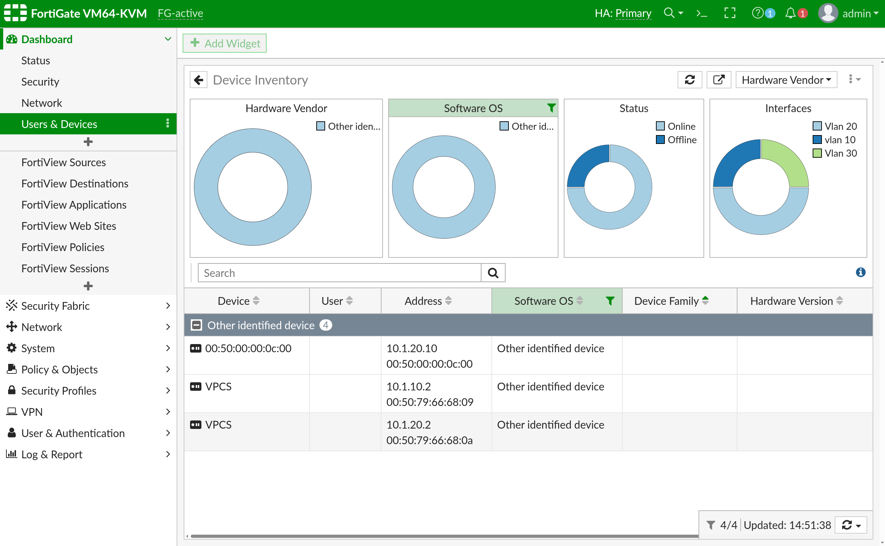

# 🏛️ System Architecture — IRON-GRID

---

## 1. Overview

IRON-GRID is a virtualized enterprise network lab built on **EVE-NG**. It follows a hierarchical, security-first design with **Defense-in-Depth** and **Zero-Trust Architecture (ZTA)** as core principles. No traffic is implicitly trusted — every inter-zone flow requires explicit firewall authorization.

---

## 2. Topology Layers

The infrastructure follows the classic three-layer hierarchical model:

| Layer | Component | Role |
|-------|-----------|------|
| **Edge** | FortiGate HA Cluster (Active/Passive) | NGFW, SD-WAN, VPN termination |
| **Core/Distribution** | Virtual switching (802.1Q trunk) | VLAN segmentation, inter-zone routing |
| **Service** | Ubuntu Server (10.1.20.10) | DNS, LDAP, Samba, Nginx, Monitoring |

### Logical Diagram



---

## 3. Component Breakdown

### 🛡️ Security Layer — FortiGate HA

The FortiGate cluster acts as the **Default Gateway for all VLANs** and the single choke point for all inter-zone and WAN traffic.

**Key capabilities:**
- **SD-WAN** — dual-WAN link health monitoring (latency/jitter/packet loss), automatic failover
- **IPSec VPN** — encrypted site-to-site tunnel between HQ and Branch
- **Deep Packet Inspection** — Antivirus, IPS, Web Filter applied on all flows
- **LDAP Integration** — FortiGate authenticates admin users against OpenLDAP

**HA Cluster:**
- Mode: Active/Passive
- Heartbeat interface: dedicated link `2.2.2.0/30`
- Sync scope: sessions, routing table, policies, IPS signatures
- Failover: sub-second (monitored link-down detection)

### 🐧 Service Layer — Ubuntu Server

A hardened Ubuntu Server hosts all infrastructure services in a single managed node within VLAN 20 (SERVERS):

| Service | Technology | Details |
|---------|-----------|---------|
| DNS | BIND9 | Authoritative for `it.local`, ACL-restricted recursion |
| Identity | OpenLDAP | `dc=it,dc=local` — users, groups, posixAccount |
| File Sharing | Samba | `IronGrid-Share` mapped to LDAP users |
| Web | Nginx | Portfolio at `portfolio.it.local` |
| SIEM | Wazuh | Log collection, FIM, active response |

### 🐍 Automation Layer

| Script | Language | Purpose |
|--------|---------|---------|
| `iron-check.py` | Python 3 | Validates service status, creates timestamped config backups |
| `create_user.sh` | Bash | Generates and injects LDIF entries into OpenLDAP in bulk |

---

## 4. Traffic Flow Analysis

### Example: User accessing Samba share

```
[VLAN 10 User] ──── FortiGate Policy Check ──── [VLAN 20 Ubuntu Server]
                         │
                         ├── Policy: VLAN10 → VLAN20 port 445 = ALLOW
                         ├── Inspection: IPS + AV engine
                         └── Log: Session recorded to Wazuh
                                        │
                              [Ubuntu: samba validates
                               LDAP credentials before
                               granting share access]
```

### Example: External attacker attempting SSH

```
[Kali 192.168.122.160] ── SSH:2222 ──► [Ubuntu 10.1.20.10]
        │
        ├── Attempt 1: FAIL → auth.log entry
        ├── Attempt 2: FAIL → auth.log entry  
        ├── Attempt 3: FAIL → Fail2Ban triggers
        │                      UFW DROP rule injected
        └── Attempt 4+: DROPPED silently
                         │
              Wazuh: Level 7 brute-force alert generated
```

---

## 5. Zero-Trust Implementation

| Principle | Implementation |
|-----------|---------------|
| Never trust, always verify | Implicit deny-all on FortiGate — no traffic passes without explicit policy |
| Least privilege | Users only have access to the VLANs and services their role requires |
| Assume breach | Wazuh monitors all nodes; FIM detects unauthorized changes in real-time |
| Microsegmentation | 4 isolated VLANs — no lateral movement without firewall policy |
